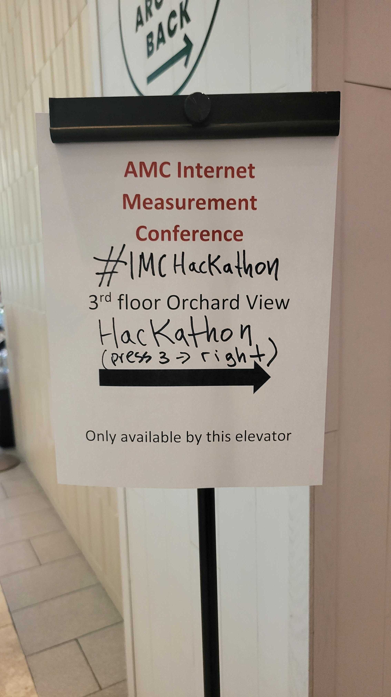

# Open Measurement Hackathon @ ACM IMC 2025

## Agenda

**Schedule**
- 13:00-14:00 Introduction to datasets and team formation
- 14:00-19:00 Time for analysis!
- 19:00-20:00 Share outs

**Location**  
Discovery Building, 330 N. Orchard St, Madison, WI 53715

**Webpage**  
[https://conferences.sigcomm.org/imc/2025/events/hackathon/](https://conferences.sigcomm.org/imc/2025/events/hackathon/)

[Hackathon Introduction Slides](IMCHackathon2025-IntroSlides.pdf)

## Datasets and Project ideas

You can find details about the datasets (descriptions, tutorials, etc.) and list of projects at [link](https://docs.google.com/document/d/1r0KI7p2K4UFwUpakCdgqqDYP11hyZtCttlvsHlJxLkw/edit?tab=t.0#heading=h.hfk34dagbznn)

## List of Projects

* [Internet outages: inbound & outbound measurements view](team-projects/cloudflare-project-1/README.md)
* [Analyze and visualize internet censorship data](team-projects/ooni-project-1/README.md)
* [Encrypted Client Hello (ECH) blocking](team-projects/ooni-project-2/README.md)
* [Examine TLS certificate diversity across countries/networks](team-projects/ooni-project-4/README.md)
* [“State of the Net”: Interactive Internet performance reports](team-projects/mlab-project-6/README.md)
* [Adding LACeS anycast geolocation dataset to Internet Yellow Pages (IYP)](team-projects/iij-projects-1-3/README.md)
* [Web centralization](team-projects/iij-project-4/README.md)
* [Comparison of v4 vs v6 performance](team-projects/ipv4-ipv6-comparison/README.md)

## Event Images

