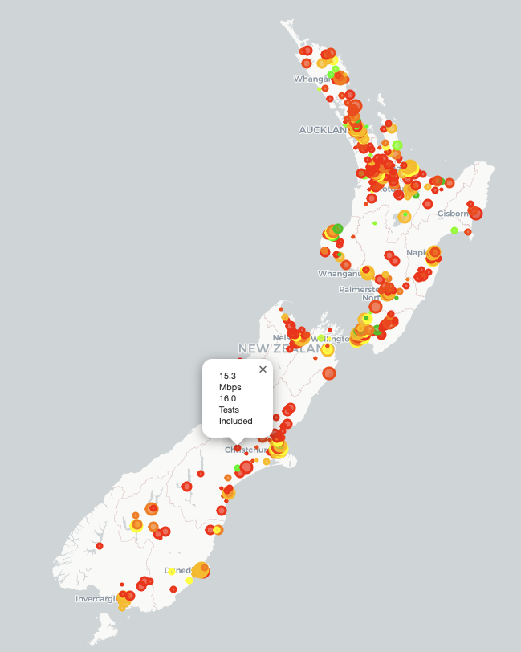

# "State of the Net": Interactive Internet perfomance reports
Our group of 2 took a split approach to this project where we each just looked into what we found interesting in the MLab data.

## New Zealand Internet Speeds Analysis
Looking at New Zealand speed tests geo-spatially, we see what we would likely expect: cities have better internet connectivity than rural regions. What is difficult to say with this dataset, however, is what factors led to this outcome. Some people might have higher quality connections available to them (fiber over coax cables, a higher bandwidth plan over a lower one) and due to budget or simply not needing the extra speeds, don't pay for it. We realized that the speedtests we see are more indicitave of what real people are seeing on whatever device, ISP provider, ISP plan, and connection type (wifi vs. ethernet) a user used than the best possible speeds available to a given community.

Regardless, it was fun to be able to map what small rural communities and cities around the country are seeing.

### Best ISP in Christchurch

Moving on, we imagined we were moving to Christchurch (largest city on the South Island) and were trying to pick the best ISP for internet access. The top entry is one of New Zealand's *Crown Research Institutes (CRI)* and therefore it could be expected that they'd have a high quality connection and most users would be using either a direct ethernet connection or wifi in a well-planned office space.

The first residential ISP we see, Voyager, received quite a bit of praise online for their speeds and reliability. It's interesting to see how various ISPs compare with this sort of insight into what real consumers are seeing with speed tests.

<table border="1" class="dataframe">
  <thead>
    <tr style="text-align: right;">
      <th>ASName</th>
      <th>median</th>
      <th>count</th>
    </tr>
  </thead>
  <tbody>
    <tr>
      <td>Agricultural Research CRI, New Zealand</td>
      <td>622.174113</td>
      <td>23</td>
    </tr>
    <tr>
      <td>ICONZ, Internet Service Provider</td>
      <td>234.024433</td>
      <td>143</td>
    </tr>
    <tr>
      <td>Internet access for Datacom Systems Auckland</td>
      <td>212.465121</td>
      <td>47</td>
    </tr>
    <tr>
      <td>Christchurch Polytechnic Institute</td>
      <td>206.571074</td>
      <td>255</td>
    </tr>
    <tr>
      <td>Voyager Internet Ltd.</td>
      <td>175.212031</td>
      <td>4976</td>
    </tr>
    <tr>
      <td>Foodstuffs SI Ltd</td>
      <td>137.399009</td>
      <td>158</td>
    </tr>
    <tr>
      <td>Link Telecom (NZ) Limited</td>
      <td>136.271638</td>
      <td>281</td>
    </tr>
    <tr>
      <td>Snap Limited</td>
      <td>113.220115</td>
      <td>5728</td>
    </tr>
    <tr>
      <td>Solarix Internet Limited</td>
      <td>111.181128</td>
      <td>82</td>
    </tr>
    <tr>
      <td>The Total Team Limited</td>
      <td>105.594274</td>
      <td>232</td>
    </tr>
    <tr>
      <td>TrustPower Ltd</td>
      <td>100.092105</td>
      <td>16866</td>
    </tr>
    <tr>
      <td>Computer Concepts Limited</td>
      <td>95.853755</td>
      <td>186</td>
    </tr>
    <tr>
      <td>University of Canterbury</td>
      <td>94.747397</td>
      <td>1792</td>
    </tr>
    <tr>
      <td>CallPlus Services Limited</td>
      <td>94.196477</td>
      <td>63895</td>
    </tr>
    <tr>
      <td>DTS LTD</td>
      <td>92.825172</td>
      <td>731</td>
    </tr>
    <tr>
      <td>Fastly</td>
      <td>82.419963</td>
      <td>315</td>
    </tr>
    <tr>
      <td>Devoli</td>
      <td>81.198767</td>
      <td>7605</td>
    </tr>
    <tr>
      <td>Airways Corporation of New Zealand</td>
      <td>76.053446</td>
      <td>82</td>
    </tr>
    <tr>
      <td>Allied Telesis ASN</td>
      <td>75.588092</td>
      <td>11</td>
    </tr>
    <tr>
      <td>Akamai Technologies, Inc.</td>
      <td>69.740662</td>
      <td>1318</td>
    </tr>
  </tbody>
</table>

